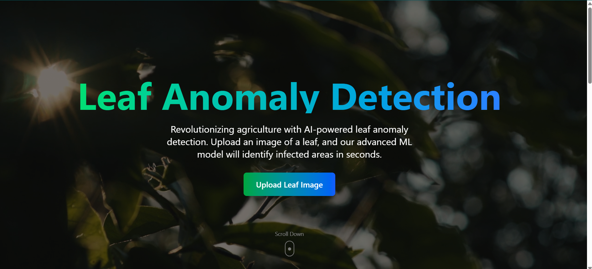
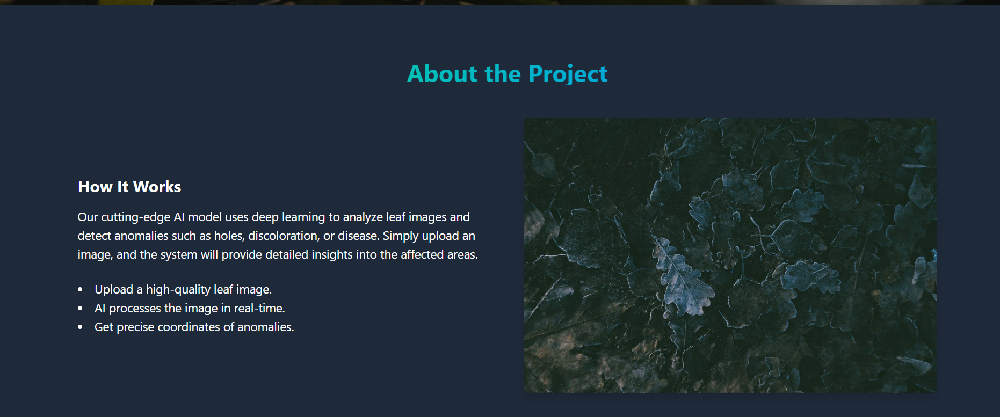
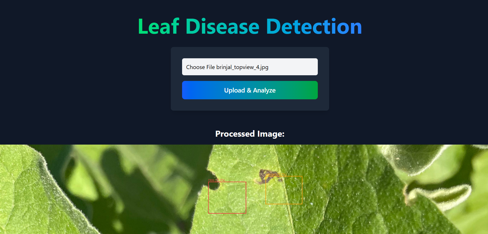
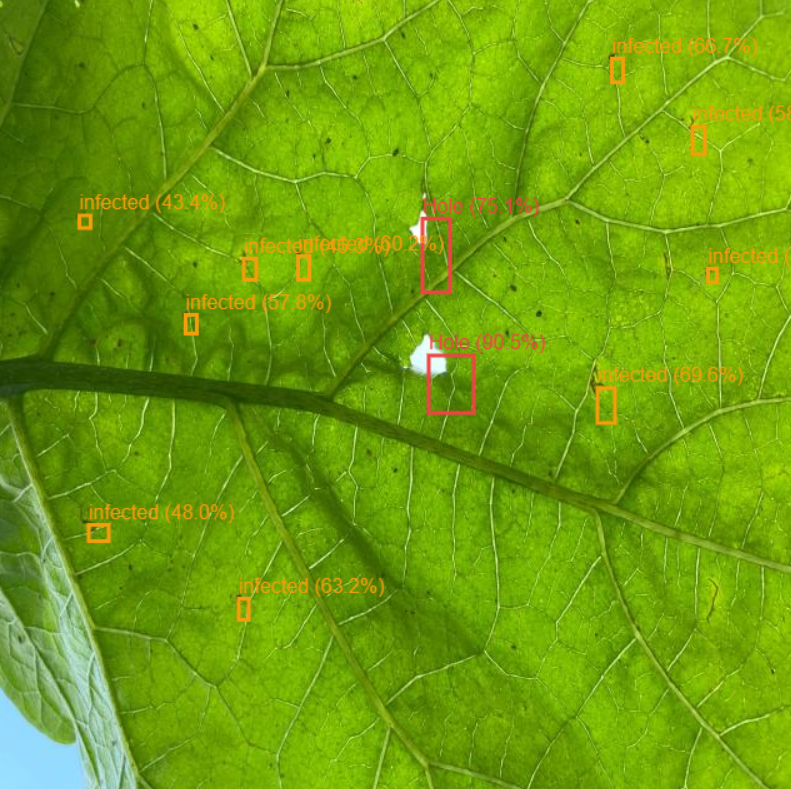
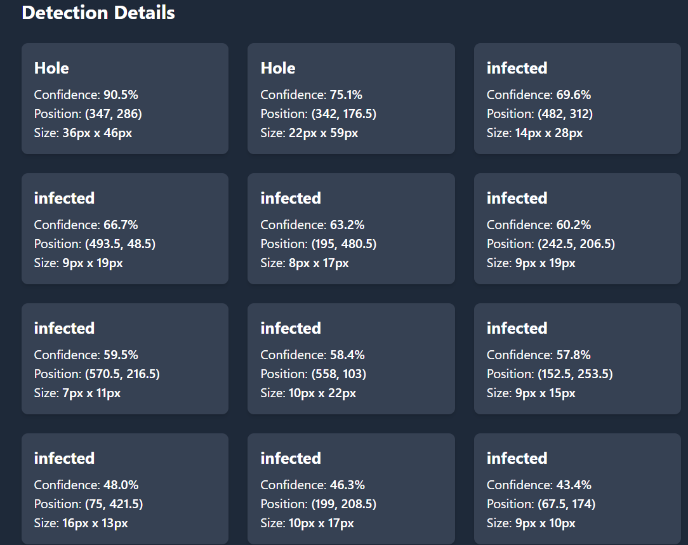
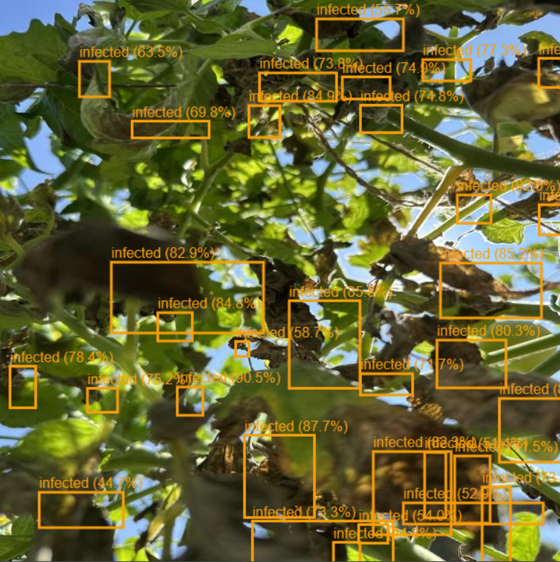
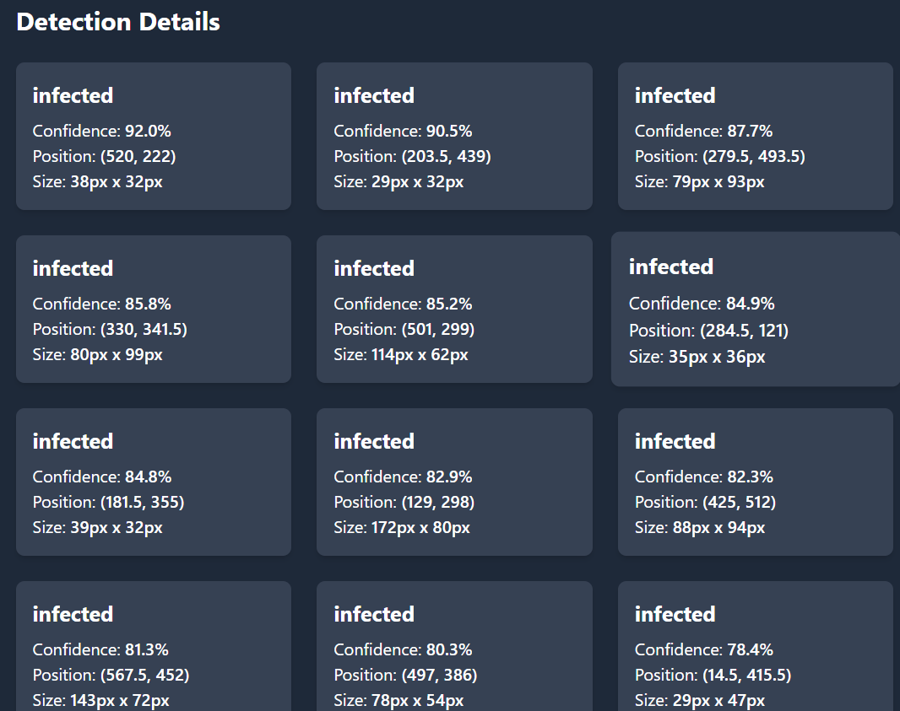

# Full-Stack Attention Mechanism and Meta-Learning for Enhanced Leaf Anomaly Detection

## Overview
This project is a full-stack application for detecting leaf anomalies using an attention mechanism and meta-learning. It consists of a **frontend (React + Vite + Tailwind CSS)** and a **backend (FastAPI + Uvicorn)**.

## Screenshots

### Home Page



###DataSet


### Results Page






## Features
- **Frontend**: Built with React, Vite, Tailwind CSS, and React Router.
- **Backend**: Developed using FastAPI, Uvicorn, and machine learning models.
- **Deployment**: Hosted on GitHub Pages (Frontend) and Render/Heroku (Backend).

## Tech Stack
- **Frontend**: React, Vite, Tailwind CSS, React Router, Axios
- **Backend**: FastAPI, Uvicorn, Machine Learning Models
- **Database**: (Mention if applicable)

---

## Installation

### 1. Clone the Repository
```bash
 git clone https://github.com/bharathyadav2004/Full-Stack-Attention-Mechanism-and-Meta-Learning-for-Enhanced-Leaf-Anomaly-Detection.git
 cd Full-Stack-Attention-Mechanism-and-Meta-Learning-for-Enhanced-Leaf-Anomaly-Detection
```

### 2. Setting Up the Frontend
```bash
cd leaf-detection
npm install  # Install dependencies
npm run dev  # Start the development server
```

### 3. Setting Up the Backend
```bash
cd ../ml
pip install -r requirements.txt  # Install dependencies
uvicorn app:app --reload  # Start the FastAPI server
```

---

## Deployment

### 1. Deploying the Frontend on GitHub Pages
```bash
npm install gh-pages --save-dev
npm run build  # Build the project
npm run deploy  # Deploy to GitHub Pages
```

### 2. Deploying the Backend on Render/Heroku
#### Using Render:
1. Create a **new Web Service** on [Render](https://render.com/).
2. Select your GitHub repository and choose `ml` as the working directory.
3. Set the **Start Command** as:
   ```bash
   uvicorn app:app --host 0.0.0.0 --port $PORT
   ```
4. Deploy and get the API URL.

#### Using Heroku:
1. Install Heroku CLI and login:
   ```bash
   heroku login
   ```
2. Create a new Heroku app and push code:
   ```bash
   heroku create
   git push heroku main
   ```
3. Set the **Start Command**:
   ```bash
   heroku ps:scale web=1
   ```
4. Deploy and get the API URL.

---

## Usage
1. **Start the backend** using FastAPI.
2. **Start the frontend** using Vite.
3. Open `http://localhost:5173` to use the application.
4. The backend API can be tested at `http://127.0.0.1:8000/docs`.

---

## License
This project is open-source and available under the [MIT License](LICENSE).
